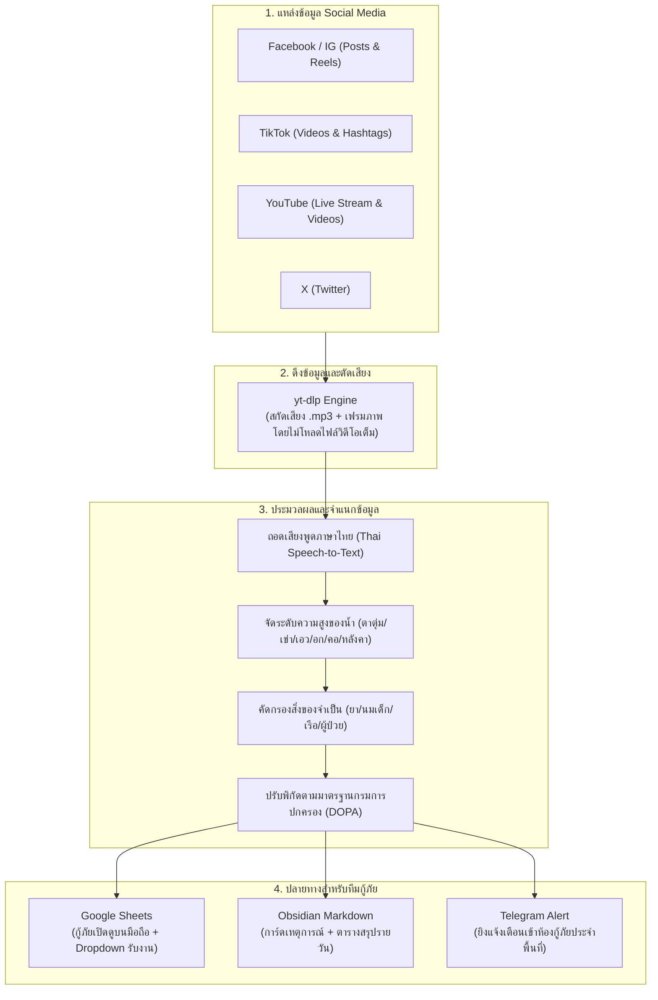

🌊 FloodVoice (เสียงน้ำท่วม)
> **ระบบเฝ้าระวังและคัดกรองสัญญาณขอความช่วยเหลือเหตุน้ำท่วมจาก Social Media**  
> *Open-Source Disaster Response Pipeline for Detecting Thai Flood Distress Signals*

[](https://opensource.org/licenses/MIT)
[](https://www.python.org/)
[](https://www.docker.com/)

**FloodVoice** คือเครื่องมือโอเพนซอร์สที่สร้างขึ้นเพื่อสนับสนุนการทำงานของ **ทีมกู้ภัย, ศูนย์สั่งการภัยพิบัติ, องค์กรปกครองส่วนท้องถิ่น และอาสาสมัคร** ในการค้นหาเสียงขอความช่วยเหลือของประชาชนที่โพสต์ผ่าน Social Media (Facebook, Instagram, TikTok และ YouTube) ทั้งในรูปแบบข้อความ, คลิปสั้น Reels/Shorts และ **Live ถ่ายทอดสด**

ระบบจะถอดเสียงพูดภาษาไทย สกัดระดับความสูงของน้ำ (ตาตุ่ม/เข่า/เอว/อก/คอ/มิดหลังคา) ระบุความต้องการฉุกเฉิน (ยาประจำตัว/นมเด็ก/เรือ/ผู้ป่วยติดเตียง) และจัดพิกัดตามมาตรฐานกรมการปกครอง (DOPA) เพื่อส่งต่อข้อมูลไปยัง **Google Sheets**, **Obsidian Markdown** และ **Telegram** ได้ทันท่วงที

---

แผนผังการทำงาน (System Architecture)



---

คู่มือตั้งค่า API Keys (ต้องเปลี่ยนตรงไหนบ้าง?)

คัดลอกไฟล์ `.env.example` ไปเป็น `.env` ก่อนเริ่มใช้งาน:
```bash
cp .env.example .env
```

| ตัวแปรในไฟล์ `.env` | หน้าที่ / การใช้งาน | แหล่งที่มา / วิธีขอรับ | ความจำเป็น |
| :--- | :--- | :--- | :--- |
| **`GEMINI_API_KEY`** | วิเคราะห์ข้อความ เสียงพูดภาษาไทย และจัดระดับน้ำ | ขอฟรีได้ที่ [Google AI Studio](https://aistudio.google.com/) *(ไม่ต้องใช้บัตรเครดิต)* | **แนะนำเป็นหลัก** (ฟรี) |
| **`OPENAI_API_KEY`** | ใช้ Whisper STT และโมเดล GPT ทางเลือก | [OpenAI Platform](https://platform.openai.com/api-keys) | ทางเลือกสำรอง |
| **`DEFAULT_AI_PROVIDER`** | กำหนดตัววิเคราะห์หลัก (`gemini` หรือ `openai`) | ตั้งค่าเป็น `gemini` เป็นค่าเริ่มต้น | มีค่าเริ่มต้นอยู่แล้ว |
| **`GOOGLE_SHEET_ID`** | รหัส Google Spreadsheet ที่ต้องการส่งข้อมูลลงตาราง | ดูจาก URL ของ Sheet: `https://docs.google.com/spreadsheets/d/<SHEET_ID>/edit` | แนะนำสำหรับทีมกู้ภัย |
| **`GOOGLE_SERVICE_ACCOUNT_FILE`** | ไฟล์สิทธิ์เชื่อมต่อ Google Sheet (`service_account.json`) | สร้าง Service Account ใน Google Cloud Console แล้วแชร์ Sheet ให้อีเมลบอท | จำเป็นเมื่อใช้ Sheets |
| **`TELEGRAM_BOT_TOKEN`** | โทเคนสำหรับส่งข้อความแจ้งเตือนเข้าแอป Telegram | ทักคุยกับ `@BotFather` ใน Telegram พิมพ์ `/newbot` | ทางเลือก |
| **`TELEGRAM_CHAT_ID`** | ID ห้องแชตหรือกลุ่มกู้ภัยที่ต้องการให้บอทส่งข้อความ | ดึงบอทเข้ากลุ่ม แล้วดู chat id ผ่าน `https://api.telegram.org/bot<TOKEN>/getUpdates` | ทางเลือก |
| **`YOUTUBE_API_KEY`** | ค้นหาวิดีโอและ Live Stream บน YouTube อัตโนมัติ | เปิดใช้งาน YouTube Data API v3 ฟรีที่ Google Cloud Console *(หากไม่ใส่ ระบบจะค้นหาผ่าน yt-dlp ให้อัตโนมัติ)* | ทางเลือก |
| **`APIFY_TOKEN`** | ใช้ดึงฟีด Facebook และ TikTok ผ่าน Cloud Scraper | รับ Token ได้จาก [Apify.com](https://apify.com/) | ทางเลือก |

> [Note]
> **เริ่มใช้งานได้ฟรี 100% ทันที:** เพียงคุณกรอก **`GEMINI_API_KEY`** เพียงตัวเดียว ระบบก็สามารถทำงานได้เต็มรูปแบบทั้งการสแกนและส่งออกผลลัพธ์เป็น Obsidian Markdown ในเครื่อง!
> เนื่องจากปัจจุบัน API  Key บางอย่างจำกัดการเข้าถึง อย่างมากในการทำ Social Listening เช่น Tiitok Reaseach API , Meta Graph API ตัว CrowdTangle ก็ปืดตัวไปแล้ว จากการทดลองใช้จึงเลือกตัว Apify มาครับ เพื่อทดแทนการใช้งานผ่าน เจ้าใหญ่ๆของแทน ซึ่งไม่มีทดลองใช้ และ API ให้ บางเจ้าก็เช่ารายปี และราคาแพง

---

วิธีการติดตั้งและเริ่มใช้งาน

วิธีที่ 1: รันบนเครื่องคอมพิวเตอร์ด้วย Python

1. **ดาวน์โหลดโปรเจกต์:**
   ```bash
   git clone https://github.com/sufarwee/FloodVoice-Thai.git
   cd FloodVoice-Thai
   ```

2. **ติดตั้งไลบรารี:**
   *(เครื่องของคุณต้องมี `ffmpeg` สำหรับประมวลผลเสียง เช่น บน Mac รัน `brew install ffmpeg` หรือบน Ubuntu รัน `sudo apt install ffmpeg`)*
   ```bash
   pip install -r requirements.txt
   ```

3. **แก้ไขไฟล์ `.env`:**
   เปิดไฟล์ `.env` แล้วใส่ `GEMINI_API_KEY` ของคุณ

4. **คำสั่งสั่งรัน:**
   ```bash
   # 1. ทดสอบการจำแนกข้อความ
   python3 main.py --test-text "ช่วยด้วยครับ ตอนนี้น้ำท่วมถึงอก ม.3 ต.กบินทร์ อ.กบินทร์บุรี ปราจีนบุรี ติดอยู่ 4 คน ต้องการเรือและอาหารด่วน"

   # 2. ทดสอบดึงเสียงและประมวลผลจากลิงก์วิดีโอ/Live โดยตรง
   python3 main.py --test-url https://www.youtube.com/watch?v=xxxx

   # 3. เริ่มระบบสแกน Social Media อัตโนมัติ (วนลูปทุก 15 นาที)
   python3 main.py --scan
   ```

---

วิธีที่ 2: รันผ่าน Docker (คลิกเดียว ไม่ต้องลงโปรแกรมเพิ่ม)

เหมาะสำหรับเปิดทิ้งไว้บน Server ตลอด 24 ชั่วโมง:
```bash
cp .env.example .env
# กรอก GEMINI_API_KEY ในไฟล์ .env
docker compose up -d --build
```
ระบบจะเปิดบริการเฝ้าระวังอัตโนมัติ โดยไฟล์ผลลัพธ์การ์ด Markdown จะถูกบันทึกไว้ที่โฟลเดอร์ `./obsidian_vault` บนเครื่องของคุณ

---

การปรับแต่งคำค้นหาและจังหวัด (`keywords.json`)

คุณสามารถระบุจังหวัดที่ต้องการเฝ้าระวังหรือคำค้นเฉพาะถิ่นได้ที่ไฟล์ `keywords.json`:

```json
{
  "monitored_provinces": [
    "ปราจีนบุรี",
    "เชียงราย",
    "สุโขทัย",
    "พระนครศรีอยุธยา"
  ],
  "search_keywords": [
    "น้ำท่วม",
    "ติดน้ำท่วม",
    "น้ำเอ่อล้นตลิ่ง",
    "ขอน้ำดื่มอาหาร",
    "ต้องการเรือ"
  ]
}
```

---

 ตัวอย่างผลลัพธ์ใน Google Sheets & Obsidian

| ความเร่งด่วน | ระดับน้ำ | จังหวัด | อำเภอ/เขต | ตำบล/แขวง | สิ่งที่ต้องการด่วน | เบอร์ติดต่อ | ลิงก์ต้นทาง |

| 🔴 CRITICAL | ระดับอก | ปราจีนบุรี | กบินทร์บุรี | กบินทร์ | เรือพาย, นมเด็ก, น้ำดื่ม | 081-xxx-xxxx | [ดูคลิป] |

| 🔴 HIGH | ระดับเอว | เชียงราย | แม่สาย | เวียงพางคำ | ข้าวกล่อง, ยาประจำตัว | 089-xxx-xxxx | [ดู Live สด] |

---

English Summary

**FloodVoice** is an open-source humanitarian tool designed to assist rescue teams and local disaster centers in monitoring and extracting flood distress signals from Thai social media videos, posts, and live streams (Facebook, Instagram, TikTok, and YouTube).

Key Features:
* **Audio & Frame Sampling:** Extracts audio streams and video keyframes via `yt-dlp` without downloading heavy video files.
* **Water Level Severity Classification:** Automatic classification from Ankle (`LEVEL_1`), Knee (`LEVEL_2`), Waist (`LEVEL_3`), Chest/Neck (`LEVEL_4`), to Roof/Submerged (`LEVEL_5`).
* **Specific Relief Needs Extraction:** Identifies critical items (chronic disease medications, infant milk formula, rescue boats, food & water, bedridden patient evacuation).
* **DOPA Administrative Normalization:** Matches informal addresses to official Thai administrative structures (Province, District, Subdistrict).
* **Ready-to-Use Outputs:** Real-time sync to Google Sheets, Obsidian Markdown event cards, and Telegram group dispatching.

---

สัญญาอนุญาต (License)

โปรเจกต์นี้เผยแพร่ภายใต้สัญญาอนุญาต [MIT License](LICENSE) ทุกคนสามารถนำไปใช้งาน แจกจ่าย และพัฒนาต่อยอดเพื่อสาธารณประโยชน์ได้อย่างอิสระ แม้จะเป็นตัวเริ่มต้น ก็หวังว่าจะเป็นประโยชน์นะครับ 
